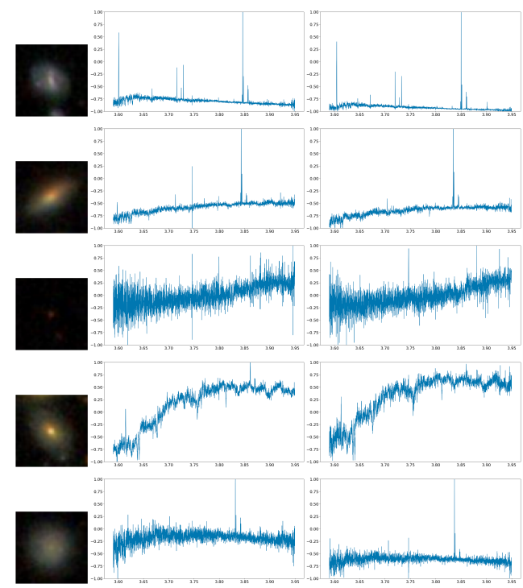

# Galaxy spectroscopy without spectra

Code used for the papers ["Galaxy spectroscopy without spectra: Galaxy properties from photometric images with conditional diffusion models"](https://arxiv.org/pdf/2406.18175) (The Astrophysical Journal) and ["Generating astronomical spectra from photometry with conditional diffusion models"](https://arxiv.org/abs/2211.05556) (NeurIPS 2022 workshop on Machine Learning and the Physical Sciences).



This repository contains the code to train our contrastive and generative networks. Code to download the data is provided in the `utils` folder.

### Abstract

Modern spectroscopic surveys can only target a small fraction of the vast amount of photometrically cataloged sources in wide-field surveys. Here, we report the development of a generative AI method capable of predicting optical galaxy spectra from photometric broad-band images alone. This method draws from the latest advances in diffusion models in combination with contrastive networks. We pass multi-band galaxy images into the architecture to obtain optical spectra. From these, robust values for galaxy properties can be derived with any methods in the spectroscopic toolbox, such as standard population synthesis techniques and Lick indices. When trained and tested on 64 × 64-pixel images from the Sloan Digital Sky Survey, the global bimodality of star-forming and quiescent galaxies in photometric space is recovered, as well as a mass-metallicity relation of star-forming galaxies. The comparison between the observed and the artificially created spectra shows good agreement in overall metallicity, age, Dn4000, stellar velocity dispersion, and E(B-V) values. Photometric redshift estimates of our generative algorithm can compete with other current, specialized deep-learning techniques. Moreover, this work is the first attempt in the literature to infer velocity dispersion from photometric images. Additionally, we can predict the presence of an active galactic nucleus up to an accuracy of $82\,\%$. With our method, scientifically interesting galaxy properties, normally requiring spectroscopic inputs, can be obtained in future data sets from large-scale photometric surveys alone. The spectra prediction via AI can further assist in creating realistic mock catalogs.

### Usage

Parameters for the contrastive network can be specified in the `params_contrastive.yml` file. The contrastive network can be trained by calling `train_contrastive.py`. 
Similarly, parameters for the diffusion model can be specified in the `params_generative.yml` file. It can then be trained by calling `train_generative.py`. 
For inference, use `generate.py`. This also makes use of `params_generative.yml` for its settings. 

### Comments 

- We use [Pytorch Ignite](https://github.com/pytorch/ignite) for training of our models.
- The cross-attention layer is based on the [Latent Diffusion Models](https://github.com/CompVis/latent-diffusion) repository.

### Citation

If you find our works helpful, consider citing them using

```
@article{doorenbos2024galaxy,
  title={Galaxy spectroscopy without spectra: Galaxy properties from photometric images with conditional diffusion models},
  author={Doorenbos, Lars and Sextl, Eva and Heng, Kevin and Cavuoti, Stefano and Brescia, Massimo and Torbaniuk, Olena and Longo, Giuseppe and Sznitman, Raphael and M{\'a}rquez-Neila, Pablo},
  journal={The Astrophysical Journal},
  volume={977},
  number={1},
  pages={131},
  year={2024},
  publisher={IOP Publishing}
}
```

and

```
@article{doorenbos2022generating,
  title={Generating astronomical spectra from photometry with conditional diffusion models},
  author={Doorenbos, Lars and Cavuoti, Stefano and Longo, Giuseppe and Brescia, Massimo and Sznitman, Raphael and M{\'a}rquez-Neila, Pablo},
  journal={arXiv preprint arXiv:2211.05556},
  year={2022}
}
```
