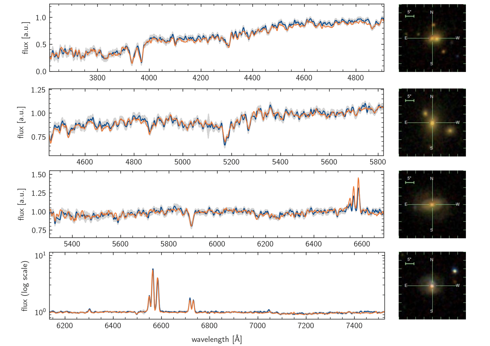

# Generating galaxy spectra from photometry with conditional diffusion models

Code used for our paper ["Generating astronomical spectra from photometry with conditional diffusion models"](https://arxiv.org/abs/2211.05556), accepted at the NeurIPS 2022 workshop on Machine Learning and the Physical Sciences.



This repository contains the code to train our contrastive and generative networks. Code to download the data is provided in the `utils` folder.

### Abstract

A trade-off between speed and information controls our understanding of astronomical objects. Fast-to-acquire photometric observations provide global properties, while costly and time-consuming spectroscopic measurements enable a better understanding of the physics governing their evolution. Here, we tackle this problem by generating galaxy spectra directly from photometry, through which we obtain an estimate of their intricacies from easily acquired images. This is done by using multimodal conditional diffusion models, where the best out of the generated spectra is selected with a contrastive network. Initial experiments on minimally processed SDSS data show promising results.

### Usage

Parameters for the contrastive network can be specified in the `params_contrastive.yml` file. The contrastive network can be trained by calling `train_contrastive.py`. 
Similarly, parameters for the diffusion model can be specified in the `params_generative.yml` file. It can then be trained by calling `train_generative.py`. 
For inference, use `generate.py`. This also makes use of `params_generative.yml` for its settings. 

### Comments 

- We use [Pytorch Ignite](https://github.com/pytorch/ignite) for training of our models.
- The cross-attention layer is based on the [Latent Diffusion Models](https://github.com/CompVis/latent-diffusion) repository.

### Citation

If you find this work helpful, consider citing it using

```
@article{doorenbos2022generating,
  title={Generating astronomical spectra from photometry with conditional diffusion models},
  author={Doorenbos, Lars and Cavuoti, Stefano and Longo, Giuseppe and Brescia, Massimo and Sznitman, Raphael and M{\'a}rquez-Neila, Pablo},
  journal={arXiv preprint arXiv:2211.05556},
  year={2022}
}
```
